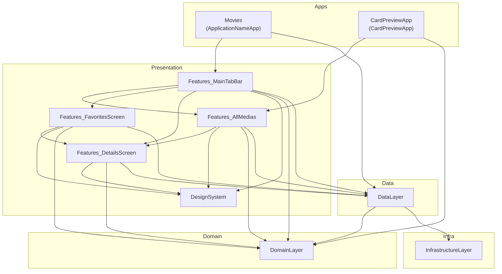
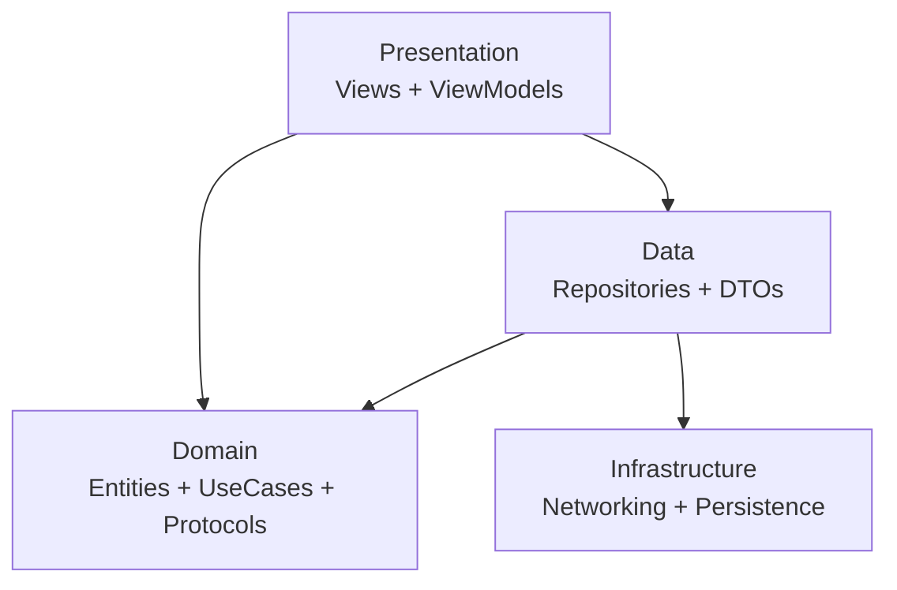
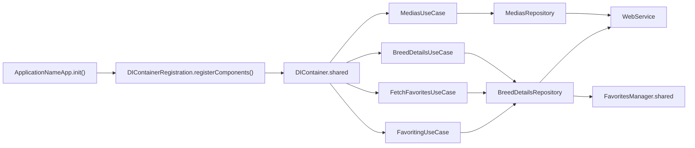
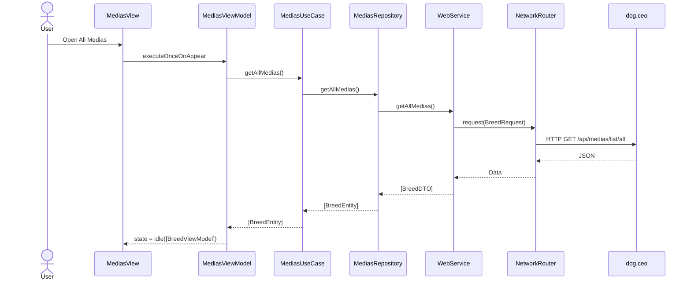
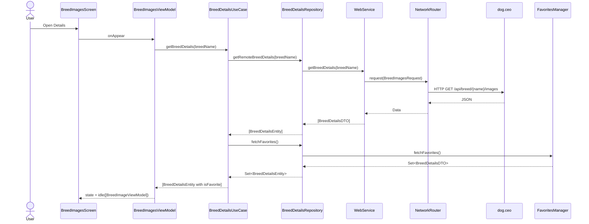
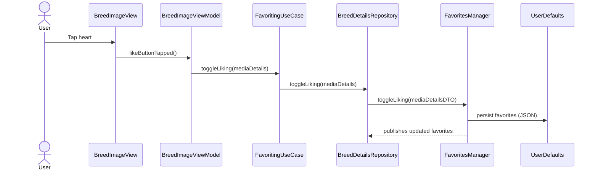
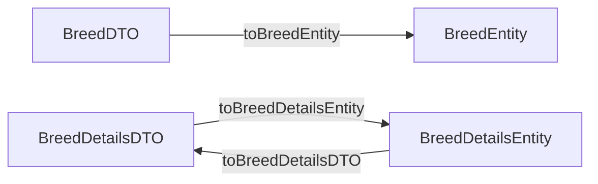
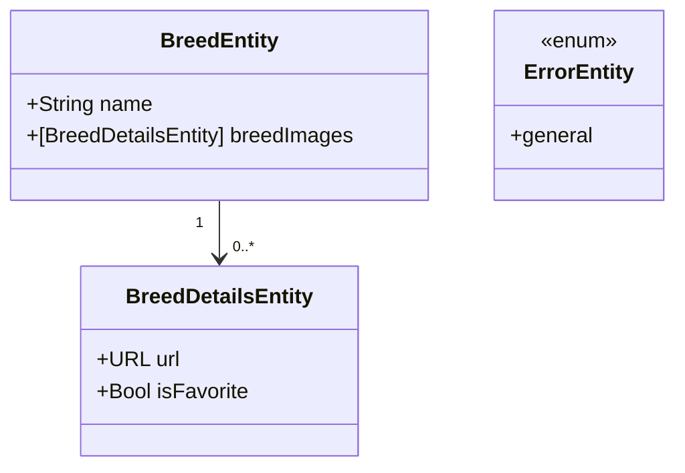
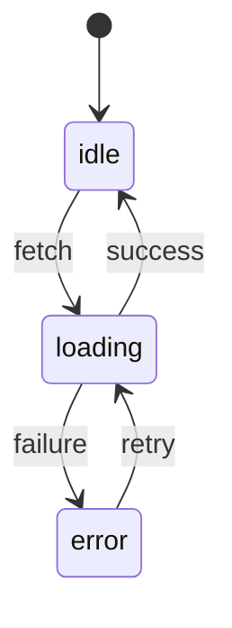

# Architecture

This document provides a concise, diagram-first overview of the Modularized iOS App template. The diagrams are derived from the current codebase.

## System Overview

## Layered Architecture (Conceptual Flow)

## App Startup and Dependency Wiring

## Main Flow: All Medias

## Details Flow (Images + Favorites Merge)

## Favorites Toggle Flow

## Networking Pipeline

```mermaid
flowchart LR
  RequestType["RequestTypeProtocol.execute()"] --> Router["NetworkRouter.request()"]
  Router --> Build["buildRequest(RequestProtocol)"]
  Build --> URLReq["URLRequest"]
  URLReq --> URLSession["URLSession.data(fromURLRequest)"]
  URLSession --> Data["Data"]
  Data --> Decode["JSONDecoder.decode(ResponseType)"]
  Decode --> DTO["DTO(s)"]
```

## Data Mapping (DTO -> Domain)

## Domain Model

## ViewState Lifecycle

